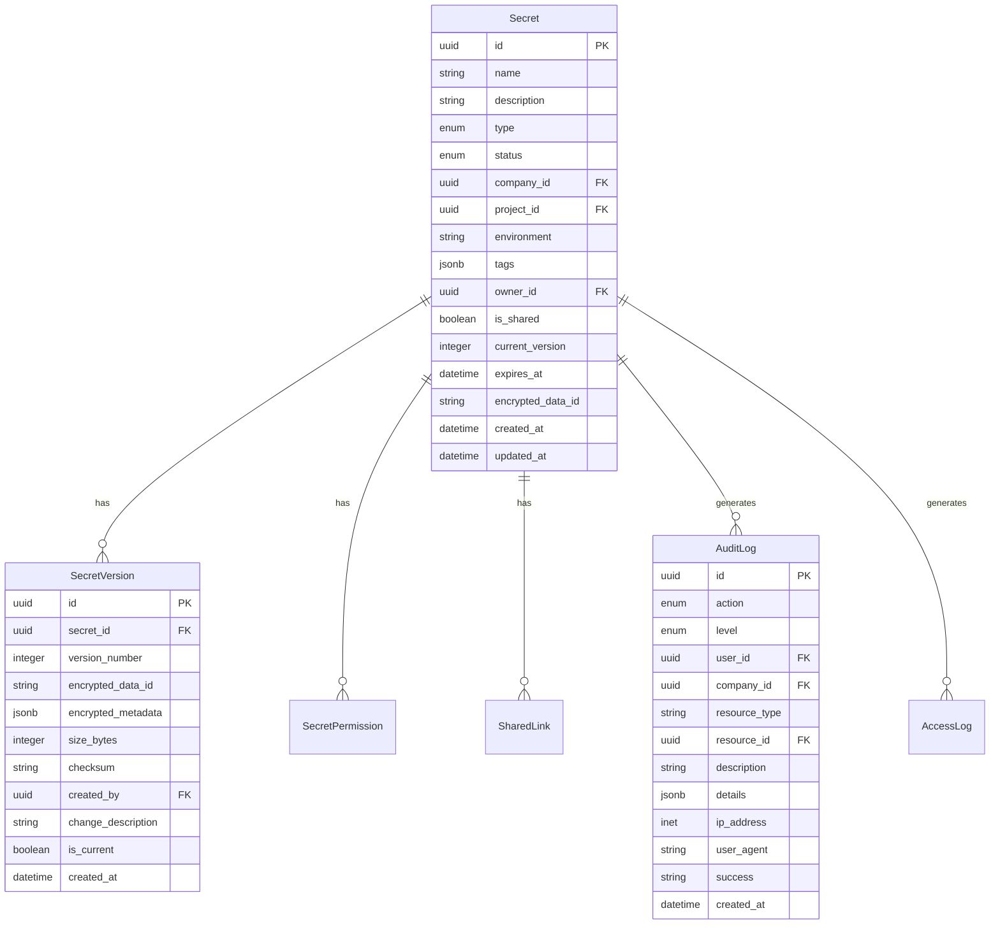
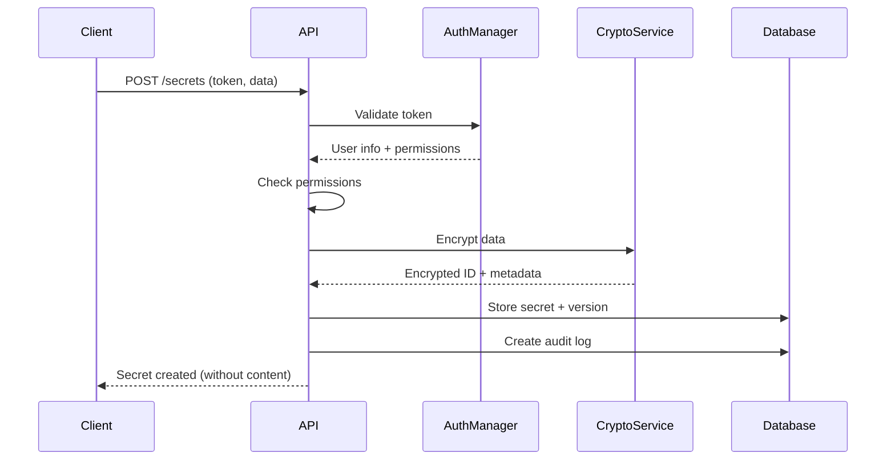
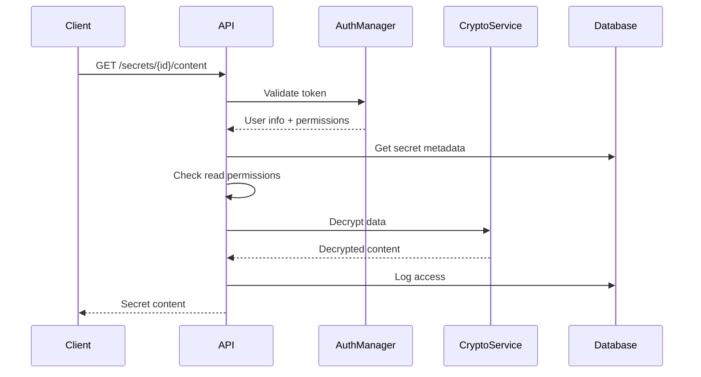
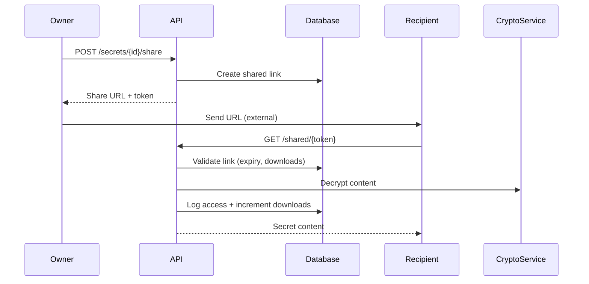

# Arquitetura do CryptVault

## Visão Geral

O CryptVault é um sistema distribuído para gerenciamento seguro de secrets, composto por múltiplos microserviços que trabalham em conjunto para garantir máxima segurança e escalabilidade.

## Componentes Principais

### 1. CryptVault Core API (Este Repositório)
**Responsabilidades:**
- API REST para gerenciamento de secrets
- Controle de acesso e permissões
- Versionamento de secrets
- Auditoria e logs
- Orquestração de serviços

**Tecnologias:**
- Python 3.11+ com FastAPI
- SQLAlchemy 2.0 (ORM assíncrono)
- PostgreSQL (banco principal)
- Redis (cache e sessões)
- Alembic (migrations)

### 2. MS-AuthManager (Externo)
**Responsabilidades:**
- Autenticação de usuários
- Gerenciamento de permissões
- Multi-tenancy (empresas)
- Controle de sessões

**Interface:**
- API REST
- JWT tokens
- Webhook notifications

### 3. Crypto Service (Futuro - Go)
**Responsabilidades:**
- Criptografia AES-256
- Gerenciamento de chaves
- HSM integration
- Key rotation

**Interface:**
- gRPC/HTTP API
- Stateless operations
- High availability

## Arquitetura de Dados

### Modelo de Dados Principal



### Padrões de Dados

1. **Soft Delete**: Secrets não são deletados fisicamente
2. **Versionamento**: Todas as alterações geram novas versões
3. **Multi-tenant**: Isolamento por `company_id`
4. **Auditoria**: Log completo de todas as operações
5. **Criptografia**: Dados sensíveis sempre criptografados

## Fluxo de Dados

### 1. Criação de Secret



### 2. Leitura de Secret



### 3. Compartilhamento Seguro



## Segurança

### 1. Defesa em Profundidade

**Camada 1: Rede**
- HTTPS obrigatório
- Rate limiting
- IP whitelisting (opcional)
- WAF (Web Application Firewall)

**Camada 2: Autenticação**
- JWT tokens via MS-AuthManager
- Token expiration
- Multi-factor authentication (futuro)

**Camada 3: Autorização**
- RBAC (Role-Based Access Control)
- Permissões granulares
- Resource-level permissions
- Company isolation

**Camada 4: Dados**
- AES-256 encryption at rest
- Encrypted data transmission
- Database encryption
- Key rotation

**Camada 5: Auditoria**
- Complete audit trail
- Security event monitoring
- Anomaly detection (futuro)
- Compliance reporting

### 2. Modelo de Ameaças

**Ameaças Mitigadas:**
- ✅ Acesso não autorizado a secrets
- ✅ Vazamento de dados em banco
- ✅ Man-in-the-middle attacks
- ✅ Privilege escalation
- ✅ Data exfiltration
- ✅ Insider threats (auditoria)

**Ameaças Futuras:**
- 🔄 Advanced persistent threats
- 🔄 Zero-day exploits
- 🔄 Social engineering
- 🔄 Supply chain attacks

## Escalabilidade

### 1. Horizontal Scaling

**Stateless Design:**
- API completamente stateless
- Session data no Redis
- Database como single source of truth

**Load Balancing:**
- Multiple API instances
- Database connection pooling
- Redis clustering (futuro)

**Microservices:**
- Independent scaling
- Circuit breakers
- Graceful degradation

### 2. Performance

**Caching Strategy:**
- Redis para metadata
- Application-level caching
- Database query optimization

**Database Optimization:**
- Índices otimizados
- Partitioning (por empresa)
- Read replicas (futuro)

**Async Operations:**
- SQLAlchemy async
- Background tasks (Celery futuro)
- Non-blocking I/O

## Monitoramento

### 1. Observabilidade

**Logs Estruturados:**
```json
{
  "timestamp": "2024-01-01T12:00:00Z",
  "level": "INFO",
  "service": "cryptvault-core",
  "action": "secret_access",
  "user_id": "uuid",
  "secret_id": "uuid",
  "ip_address": "10.0.0.1",
  "duration_ms": 150
}
```

**Métricas (Futuro):**
- Request rate
- Response time
- Error rate
- Secret operations count
- User activity

**Tracing (Futuro):**
- Distributed tracing
- Request correlation
- Performance profiling

### 2. Alertas

**Críticos:**
- Authentication failures spike
- Unauthorized access attempts
- Crypto service failures
- Database connectivity issues

**Warnings:**
- High response times
- Unusual access patterns
- Secret expiration
- Storage capacity

## Disaster Recovery

### 1. Backup Strategy

**Database:**
- Automated daily backups
- Point-in-time recovery
- Cross-region replication (futuro)

**Secrets:**
- Encrypted backup of secret data
- Key backup in HSM (futuro)
- Metadata backup

### 2. Recovery Procedures

**RTO (Recovery Time Objective):** 4 hours
**RPO (Recovery Point Objective):** 1 hour

**Procedures:**
1. Database restore from backup
2. Application deployment
3. Service health verification
4. User notification

## Compliance

### 1. Standards

**LGPD/GDPR:**
- Data minimization
- Right to erasure
- Data portability
- Consent management

**SOC 2:**
- Security controls
- Availability monitoring
- Processing integrity
- Confidentiality measures

**ISO 27001:**
- Information security management
- Risk assessment
- Security policies
- Incident response

### 2. Auditoria

**Logs Requeridos:**
- All secret operations
- Authentication events
- Permission changes
- Data access patterns
- Security incidents

**Retention:**
- Audit logs: 7 years
- Access logs: 2 years
- Security events: Indefinite
- User data: Per LGPD requirements

## Evolução da Arquitetura

### Fase 1 - MVP (Atual)
- ✅ Core API functionality
- ✅ Basic authentication
- ✅ PostgreSQL storage
- ✅ Docker deployment

### Fase 2 - Produção
- 🔄 Crypto service integration
- 🔄 Advanced monitoring
- 🔄 High availability setup
- 🔄 Performance optimization

### Fase 3 - Enterprise
- 📋 Multi-region deployment
- 📋 Advanced compliance features
- 📋 AI-powered security
- 📋 Zero-trust architecture

## Considerações Técnicas

### 1. Design Patterns

**Repository Pattern:**
- Abstração de acesso a dados
- Testabilidade
- Flexibilidade de storage

**Service Layer:**
- Lógica de negócio centralizada
- Reutilização de código
- Separação de responsabilidades

**Dependency Injection:**
- Baixo acoplamento
- Testabilidade
- Configuração flexível

### 2. Clean Architecture

```
┌─────────────────────────────────────┐
│           Frameworks & Drivers      │
│  (FastAPI, SQLAlchemy, PostgreSQL)  │
├─────────────────────────────────────┤
│         Interface Adapters          │
│    (API Routes, DB Repositories)    │
├─────────────────────────────────────┤
│           Use Cases                 │
│    (Services, Business Logic)       │
├─────────────────────────────────────┤
│            Entities                 │
│      (Models, Domain Logic)         │
└─────────────────────────────────────┘
```

### 3. Error Handling

**Strategy:**
- Graceful degradation
- Circuit breakers
- Retry mechanisms
- User-friendly error messages
- Detailed logging for debugging

