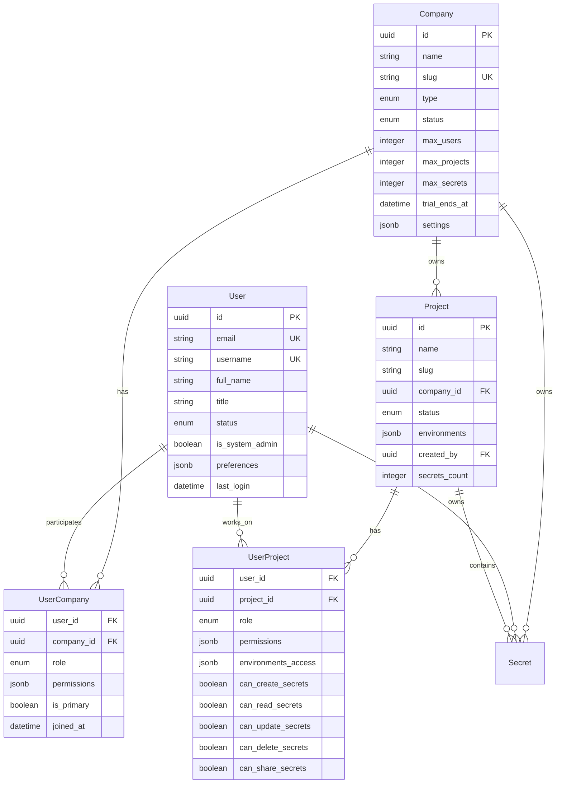

# 🏢 CryptVault Multi-Tenant - Upgrade Completo

## 🎯 **Visão Geral das Melhorias**

O sistema foi completamente reformulado para ser **multi-tenant enterprise-grade** com relacionamentos complexos entre usuários, empresas e projetos. Agora suporta:

- ✅ **Usuários em múltiplas empresas** com roles diferentes
- ✅ **Empresas com múltiplos usuários** e hierarquia de permissões
- ✅ **Projetos por empresa** com controle granular de acesso
- ✅ **Permissões por ambiente** (dev, staging, prod)
- ✅ **Sistema de convites** para equipes
- ✅ **Auditoria completa** multi-tenant
- ✅ **Isolamento total** entre empresas

## 🗄️ **Novo Modelo de Dados**

### **1. Estrutura Organizacional**



### **2. Tabelas Principais**

#### **Companies (Empresas)**
```sql
- id (UUID, PK)
- name (string, not null)
- slug (string, unique)
- type (enum: startup, sme, enterprise, agency, freelancer, non_profit)
- status (enum: active, suspended, trial, premium)
- max_users, max_projects, max_secrets (limits)
- trial_ends_at, subscription_expires_at
- settings (JSONB)
```

#### **Users (Usuários)**
```sql
- id (UUID, PK)
- email (string, unique)
- username (string, unique)
- full_name (string)
- title (string) -- cargo/posição
- status (enum: active, inactive, suspended, pending_activation)
- is_system_admin (boolean)
- timezone, language (strings)
- preferences (JSONB)
- last_login, last_password_change
```

#### **Projects (Projetos)**
```sql
- id (UUID, PK)
- name (string)
- slug (string) -- único por empresa
- company_id (UUID, FK)
- status (enum: active, archived, planning, development, production)
- environments (JSONB array: ["dev", "staging", "prod"])
- created_by (UUID, FK)
- repository_url, documentation_url
- tags (JSONB)
```

#### **User_Companies (Many-to-Many)**
```sql
- user_id (UUID, FK)
- company_id (UUID, FK)
- role (enum: super_admin, company_admin, project_manager, developer, viewer, auditor)
- permissions (JSONB array)
- is_primary (boolean) -- empresa principal do usuário
- joined_at, last_access
```

#### **User_Projects (Many-to-Many)**
```sql
- user_id (UUID, FK)
- project_id (UUID, FK)
- role (enum)
- permissions (JSONB)
- environments_access (JSONB: ["dev", "prod"])
- can_create_secrets, can_read_secrets, etc. (booleans)
```

#### **Team_Invitations (Convites)**
```sql
- email (string)
- token (string, unique)
- company_id, project_id (optional)
- role, permissions, environments_access
- invited_by, expires_at, accepted_at
```

### **3. Secrets Atualizados**
```sql
- company_id (UUID, FK to companies)
- project_id (UUID, FK to projects)
- owner_id (UUID, FK to users)
-- Agora com relacionamentos explícitos
```

## 🔐 **Sistema de Permissões Avançado**

### **1. Níveis de Permissão**

#### **Sistema (Super Admin)**
- Acesso a todas as empresas
- Gerenciamento global do sistema
- Logs de auditoria globais

#### **Empresa (Company Admin)**
- Gerenciamento completo da empresa
- Adicionar/remover usuários
- Criar/gerenciar projetos
- Configurar limites e quotas

#### **Projeto (Project Manager)**
- Gerenciamento do projeto específico
- Adicionar usuários ao projeto
- Configurar ambientes
- Controle de secrets do projeto

#### **Desenvolvedor (Developer)**
- Acesso aos projetos autorizados
- CRUD de secrets conforme permissões
- Acesso aos ambientes permitidos

#### **Visualizador (Viewer)**
- Apenas leitura dos recursos permitidos
- Acesso a logs de auditoria

#### **Auditor (Auditor)**
- Acesso completo a logs
- Relatórios de compliance
- Sem acesso a secrets

### **2. Permissões Granulares**

```typescript
// Permissões por Empresa
company:admin        // Gerenciar empresa
company:read         // Ver informações da empresa
company:billing      // Gerenciar assinatura

// Permissões por Projeto
project:admin        // Gerenciar projeto
project:read         // Ver projeto
project:create       // Criar projetos

// Permissões por Secret
secret:admin         // Gerenciar todos os secrets
secret:read          // Ler secrets
secret:create        // Criar secrets
secret:update        // Atualizar secrets
secret:delete        // Deletar secrets
secret:share         // Compartilhar secrets

// Permissões por Usuário
user:admin           // Gerenciar usuários
user:read            // Ver usuários
user:invite          // Convidar usuários

// Permissões de Auditoria
audit:read           // Ver logs
audit:admin          // Gerenciar auditoria
security:read        // Ver eventos de segurança
security:manage      // Gerenciar eventos
```

### **3. Controle por Ambiente**

```json
{
  "environments_access": ["dev", "staging", "prod"],
  "permissions_per_env": {
    "dev": ["read", "write", "delete"],
    "staging": ["read", "write"],
    "prod": ["read"]
  }
}
```

## 🚀 **Nova API Multi-Tenant**

### **1. Endpoints de Empresa**

```bash
# Gerenciamento de Empresas
POST   /api/v1/companies/              # Criar empresa
GET    /api/v1/companies/              # Listar empresas do usuário
GET    /api/v1/companies/{id}          # Obter empresa
PUT    /api/v1/companies/{id}          # Atualizar empresa
GET    /api/v1/companies/{id}/users    # Usuários da empresa
GET    /api/v1/companies/{id}/stats    # Estatísticas da empresa
```

### **2. Endpoints de Projeto**

```bash
# Gerenciamento de Projetos
POST   /api/v1/projects/               # Criar projeto
GET    /api/v1/projects/               # Listar projetos
GET    /api/v1/projects/{id}           # Obter projeto
PUT    /api/v1/projects/{id}           # Atualizar projeto
DELETE /api/v1/projects/{id}           # Remover projeto
GET    /api/v1/projects/{id}/users     # Usuários do projeto
POST   /api/v1/projects/{id}/users     # Adicionar usuário ao projeto
```

### **3. Endpoints de Usuário**

```bash
# Gerenciamento de Usuários
GET    /api/v1/users/me                # Contexto do usuário atual
POST   /api/v1/users/me/switch-company # Trocar empresa ativa
GET    /api/v1/users/                  # Listar usuários
GET    /api/v1/users/{id}              # Obter usuário
PUT    /api/v1/users/{id}              # Atualizar usuário
```

### **4. Endpoints de Equipe**

```bash
# Gerenciamento de Equipes
POST   /api/v1/teams/invite            # Convidar usuário
GET    /api/v1/teams/invitations       # Listar convites
POST   /api/v1/teams/accept/{token}    # Aceitar convite
DELETE /api/v1/teams/invitations/{id}  # Cancelar convite
```

### **5. Secrets com Contexto**

```bash
# Secrets com filtros multi-tenant
GET /api/v1/secrets/?company_id={id}&project_id={id}&environment=prod
GET /api/v1/secrets/?user_id={id}      # Secrets do usuário
GET /api/v1/secrets/accessible         # Secrets que o usuário pode acessar
```

## 📊 **Casos de Uso Avançados**

### **1. Cenário: Agência Digital**

```json
{
  "company": "Vinci Code (Agência)",
  "users": [
    {
      "name": "João Silva",
      "role": "company_admin",
      "permissions": ["company:admin", "project:admin", "user:admin"]
    },
    {
      "name": "Maria Santos", 
      "role": "developer",
      "companies": [
        {
          "name": "Vinci Code",
          "role": "developer",
          "projects": ["website-cliente-a", "app-cliente-b"]
        },
        {
          "name": "Cliente Startup",
          "role": "project_manager",
          "projects": ["mvp-produto"]
        }
      ]
    }
  ],
  "projects": [
    {
      "name": "Website Cliente A",
      "environments": ["dev", "staging", "prod"],
      "team": [
        {"user": "maria", "environments": ["dev", "staging"], "can_prod": false}
      ]
    }
  ]
}
```

### **2. Cenário: Empresa Enterprise**

```json
{
  "company": "Big Corp Enterprise",
  "structure": {
    "departments": [
      {
        "name": "Engineering",
        "projects": ["core-api", "mobile-app", "data-pipeline"],
        "environments": ["dev", "qa", "staging", "prod"],
        "team_lead": "tech-lead@corp.com",
        "developers": [
          {
            "email": "dev1@corp.com",
            "environments": ["dev", "qa"],
            "can_create_secrets": true,
            "can_prod_read": false
          }
        ]
      },
      {
        "name": "DevOps",
        "projects": ["infrastructure", "monitoring"],
        "environments": ["prod"],
        "team": [
          {
            "email": "devops@corp.com",
            "role": "company_admin",
            "all_environments": true
          }
        ]
      }
    ]
  }
}
```

### **3. Cenário: Freelancer Multi-Cliente**

```json
{
  "freelancer": "pedro@freelancer.com",
  "companies": [
    {
      "name": "Startup A",
      "role": "project_manager",
      "projects": ["mvp"],
      "permissions": ["project:admin", "secret:admin"],
      "environments": ["dev", "prod"]
    },
    {
      "name": "Empresa B",
      "role": "developer",
      "projects": ["website"],
      "permissions": ["secret:read", "secret:create"],
      "environments": ["dev"]
    }
  ]
}
```

## 🔄 **Fluxos de Trabalho**

### **1. Onboarding de Nova Empresa**

```bash
# 1. Criar empresa
POST /api/v1/companies/
{
  "name": "Nova Startup",
  "slug": "nova-startup",
  "type": "startup"
}

# 2. Usuário criador vira company_admin automaticamente

# 3. Criar primeiro projeto
POST /api/v1/projects/
{
  "name": "MVP",
  "company_id": "uuid",
  "environments": ["dev", "staging", "prod"]
}

# 4. Convidar desenvolvedores
POST /api/v1/teams/invite
{
  "email": "dev@startup.com",
  "company_id": "uuid", 
  "project_id": "uuid",
  "role": "developer",
  "environments_access": ["dev", "staging"]
}
```

### **2. Gerenciamento de Acesso a Produção**

```bash
# 1. Criar secret apenas para produção
POST /api/v1/secrets/
{
  "name": "DB_PASSWORD_PROD",
  "content": "super-secret",
  "environment": "prod",
  "project_id": "uuid"
}

# 2. Dar acesso específico a DevOps
PUT /api/v1/projects/{id}/users/{user_id}
{
  "environments_access": ["prod"],
  "can_read_secrets": true,
  "can_update_secrets": false
}

# 3. Logs de auditoria automáticos para prod
GET /api/v1/audit/logs?environment=prod&level=critical
```

### **3. Consultoria Multi-Cliente**

```bash
# 1. Usuário já existe em empresa principal
GET /api/v1/users/me
{
  "user": {...},
  "companies": [
    {"name": "Consultoria ABC", "role": "company_admin", "is_primary": true}
  ]
}

# 2. Cliente convida consultor
POST /api/v1/teams/invite
{
  "email": "consultor@abc.com",
  "company_id": "cliente-uuid",
  "role": "project_manager",
  "permissions": ["project:admin", "secret:read", "secret:create"]
}

# 3. Consultor aceita e agora tem acesso a múltiplas empresas
POST /api/v1/teams/accept/{token}

# 4. Troca contexto entre empresas
POST /api/v1/users/me/switch-company
{"company_id": "cliente-uuid"}
```

## 🔍 **Exemplos de Consultas Complexas**

### **1. Secrets Acessíveis pelo Usuário**

```sql
-- Todos os secrets que o usuário pode acessar
SELECT s.*, c.name as company_name, p.name as project_name
FROM secrets s
JOIN companies c ON s.company_id = c.id
LEFT JOIN projects p ON s.project_id = p.id
JOIN user_companies uc ON s.company_id = uc.company_id
WHERE uc.user_id = $user_id 
  AND uc.is_active = true
  AND (
    -- Proprietário do secret
    s.owner_id = $user_id 
    OR 
    -- Tem permissão na empresa
    'secret:read' = ANY(uc.permissions)
    OR
    -- Tem permissão no projeto específico
    EXISTS (
      SELECT 1 FROM user_projects up 
      WHERE up.user_id = $user_id 
        AND up.project_id = s.project_id
        AND up.can_read_secrets = true
        AND (s.environment = ANY(up.environments_access) OR up.environments_access IS NULL)
    )
  )
```

### **2. Usuários com Acesso a Produção**

```sql
-- Usuários que podem acessar ambiente de produção
SELECT DISTINCT u.*, c.name as company_name, p.name as project_name
FROM users u
JOIN user_projects up ON u.id = up.user_id
JOIN projects p ON up.project_id = p.id  
JOIN companies c ON p.company_id = c.id
WHERE 'prod' = ANY(up.environments_access)
  AND up.is_active = true
  AND u.status = 'active'
ORDER BY c.name, p.name, u.full_name
```

### **3. Auditoria Cross-Company**

```sql
-- Ações de um usuário em todas as suas empresas
SELECT al.*, c.name as company_name, s.name as secret_name
FROM audit_logs al
JOIN companies c ON al.company_id = c.id
LEFT JOIN secrets s ON al.secret_id = s.id
WHERE al.user_id = $user_id
  AND al.created_at >= NOW() - INTERVAL '30 days'
ORDER BY al.created_at DESC
```

## 🧪 **Novos Tokens de Teste**

### **Tokens Multi-Tenant Disponíveis:**

```bash
# Admin da Vinci Code (acesso total)
admin-token

# Desenvolvedor multi-empresa (Vinci Code + Startup ABC)
dev-token

# Auditor apenas leitura
viewer-token
```

### **Dados Mock Incluídos:**

```json
{
  "companies": [
    {
      "id": "vinci-code-uuid",
      "name": "Vinci Code",
      "slug": "vinci-code", 
      "type": "agency",
      "status": "active"
    },
    {
      "id": "startup-abc-uuid",
      "name": "Startup ABC",
      "slug": "startup-abc",
      "type": "startup", 
      "status": "trial"
    }
  ],
  "users": [
    {
      "token": "admin-token",
      "user": "João Silva (CTO)",
      "companies": ["Vinci Code (admin)"]
    },
    {
      "token": "dev-token", 
      "user": "Maria Santos (Dev)",
      "companies": [
        "Vinci Code (developer)",
        "Startup ABC (project_manager)"
      ]
    },
    {
      "token": "viewer-token",
      "user": "Pedro Viewer (Auditor)", 
      "companies": ["Vinci Code (viewer)"]
    }
  ]
}
```

## 🎯 **Como Testar o Sistema Multi-Tenant**

### **1. Teste Básico de Contexto**

```bash
# Obter contexto do usuário multi-empresa
curl -H "Authorization: Bearer dev-token" \
     http://localhost:8000/api/v1/users/me

# Resposta esperada:
{
  "user": {"name": "Maria Santos", ...},
  "current_company_id": "vinci-code-uuid",
  "companies": [
    {
      "company_id": "vinci-code-uuid",
      "company_name": "Vinci Code", 
      "role": "developer",
      "is_primary": true,
      "permissions": ["secret:read", "secret:create", ...]
    },
    {
      "company_id": "startup-abc-uuid",
      "company_name": "Startup ABC",
      "role": "project_manager", 
      "is_primary": false,
      "permissions": ["project:admin", "secret:admin", ...]
    }
  ]
}
```

### **2. Teste de Troca de Empresa**

```bash
# Trocar para Startup ABC
curl -X POST \
  -H "Authorization: Bearer dev-token" \
  -H "Content-Type: application/json" \
  -d '{"company_id": "startup-abc-uuid"}' \
  http://localhost:8000/api/v1/users/me/switch-company
```

### **3. Teste de Criação de Empresa**

```bash
# Criar nova empresa (admin-token)
curl -X POST \
  -H "Authorization: Bearer admin-token" \
  -H "Content-Type: application/json" \
  -d '{
    "name": "Minha Nova Empresa",
    "slug": "minha-nova-empresa",
    "type": "startup",
    "description": "Empresa para testes"
  }' \
  http://localhost:8000/api/v1/companies/
```

### **4. Teste de Listagem Multi-Tenant**

```bash
# Listar empresas do usuário
curl -H "Authorization: Bearer dev-token" \
     http://localhost:8000/api/v1/companies/

# Listar secrets com filtro por empresa
curl -H "Authorization: Bearer dev-token" \
     "http://localhost:8000/api/v1/secrets/?company_id=vinci-code-uuid"
```

## 📈 **Melhorias vs Versão Anterior**

### **Antes (Single-Tenant)**
- ❌ Um usuário = Uma empresa
- ❌ Permissões simples (admin/user)
- ❌ Sem isolamento real
- ❌ Projetos como simples categorias
- ❌ Sem controle por ambiente

### **Agora (Multi-Tenant Enterprise)**
- ✅ Usuário em múltiplas empresas
- ✅ Roles complexos por contexto
- ✅ Isolamento total entre empresas
- ✅ Projetos como entidades completas
- ✅ Controle granular por ambiente
- ✅ Sistema de convites
- ✅ Auditoria cross-company
- ✅ Limites e quotas por empresa
- ✅ Billing e trial management
- ✅ Permissões hierárquicas

## 🚀 **Próximos Passos**

### **Implementação Completa (1-2 semanas)**
1. ✅ Completar services faltantes
2. ✅ Implementar convites de equipe
3. ✅ Adicionar testes de integração
4. ✅ UI básica para gerenciamento

### **Features Avançadas (1-2 meses)**
1. 📋 Dashboard multi-tenant
2. 📋 Billing e assinaturas
3. 📋 SSO por empresa
4. 📋 API rate limiting por empresa
5. 📋 Backup por empresa
6. 📋 Compliance reporting

### **Enterprise Features (3-6 meses)**
1. 📋 Active Directory integration
2. 📋 Custom roles builder
3. 📋 Workflow approvals
4. 📋 Advanced analytics
5. 📋 Multi-region deployment

---

## 💡 **Resumo**

O CryptVault agora é um **sistema enterprise multi-tenant completo** que suporta:

- 🏢 **Múltiplas empresas** por usuário
- 👥 **Múltiplos usuários** por empresa  
- 📁 **Projetos organizacionais** com controle granular
- 🔐 **Permissões hierárquicas** e por ambiente
- 📊 **Auditoria completa** cross-tenant
- 🔗 **Sistema de convites** para colaboração
- 🛡️ **Isolamento total** entre empresas

Este é agora um sistema de **nível enterprise** pronto para competir com soluções como HashiCorp Vault, AWS Secrets Manager, e outras ferramentas corporativas de gerenciamento de secrets.

**🎉 O CryptVault Multi-Tenant está pronto para escalar para qualquer tamanho de organização!**

